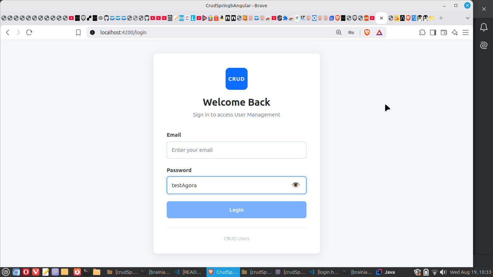
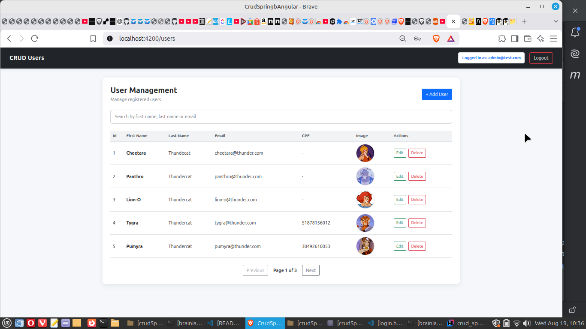
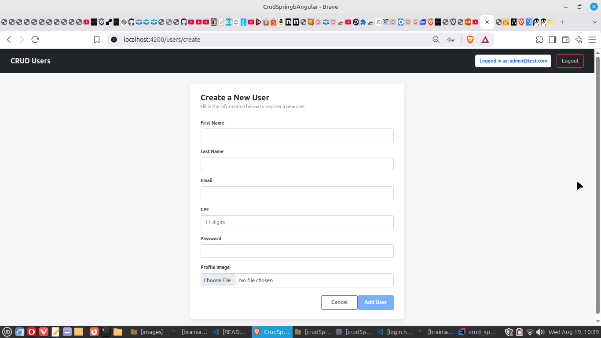
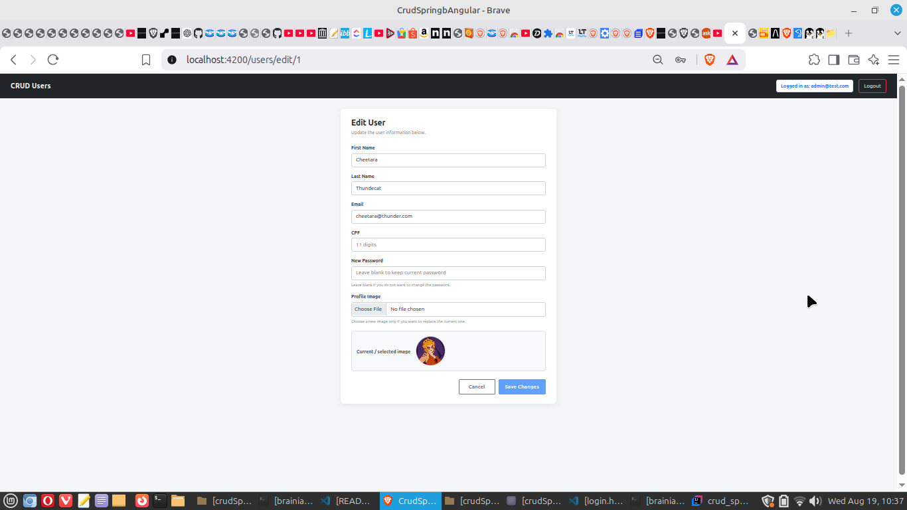

# CRUD Spring Boot + Angular — Version 02


Full-stack user management application developed with **Spring Boot**, **Angular** and **PostgreSQL**.

This project started as a simple CRUD application with profile image uploads and was progressively improved to include authentication, security, CPF validation, pagination, search and a redesigned user interface.

Version 02 represents **Phase 01** of the project's evolution.

## Project Origin

This project is an evolution of my first functional Angular project, where I learned and practiced the fundamentals of Angular integrated with Spring Boot.

Original project:

[CRUD Spring Boot + Angular 21 Standalone - Image Table](https://github.com/MarcelMotta-J/crudSpringBootAngular21Standalone_image_table)

The original version focused on learning the fundamentals of:

- Angular standalone components
- Spring Boot REST API integration
- User CRUD operations
- Image upload and display
- Frontend and backend communication

Version 02 builds upon that foundation and introduces PostgreSQL, Spring Security, JWT authentication, CPF validation, improved error handling, pagination, search and a redesigned user interface.

---

## Features

- User authentication with JWT
- Spring Security integration
- Stateless authentication
- Password encryption with BCrypt
- Protected backend endpoints
- User CRUD operations
- Profile image upload
- Existing image preservation during user updates
- Optional password change during user updates
- CPF support
- Mathematical CPF validation in the backend
- CPF format validation in Angular
- Unique CPF and email protection
- Global API exception handling
- HTTP `400 Bad Request` for validation errors
- HTTP `409 Conflict` for duplicate data
- User search
- Pagination
- PostgreSQL persistence
- CORS configuration through Spring Security
- Environment variables for sensitive configuration
- Responsive user management interface
- Password visibility toggle on the login screen

---

## Screenshots

Screenshots are stored in:

```text
docs/images/
```

### Login



### User List



### Create User



### Edit User



---

## Technologies

### Backend

- Java 17
- Spring Boot 3.5.16
- Spring Web
- Spring Data JPA
- Spring Security
- OAuth2 Resource Server
- JWT
- Bean Validation
- Hibernate
- PostgreSQL
- Maven

### Frontend

- Angular 20.3
- TypeScript
- HTML
- CSS
- Bootstrap 5.0.2
- Reactive Forms
- Angular Router
- Standalone Components

---

## Architecture

The application is divided into two main projects:

```text
crudSpringBootAngular_imagens_02/
│
├── backend/
│   └── crud_springb_angular/
│       ├── src/
│       ├── uploads/
│       └── pom.xml
│
├── frontend/
│   └── crud_springb_angular/
│       ├── src/
│       └── package.json
│
├── docs/
│   └── images/
│
└── README.md
```

The Angular frontend communicates with the Spring Boot REST API.

Spring Boot handles authentication, business rules, validation, image management and persistence.

PostgreSQL stores the application data.

---

## Authentication

Authentication is implemented using **Spring Security + JWT**.

After a successful login, the backend generates a JWT token. The Angular application uses this token when accessing protected endpoints.

The backend uses stateless authentication:

```text
Angular
   |
   | Login
   v
Spring Security
   |
   | JWT
   v
Angular
   |
   | Authorization: Bearer <token>
   v
Protected REST API
```

Passwords are stored using **BCrypt hashing**.

---

## CPF Validation

CPF validation is implemented on both sides of the application.

### Angular

The frontend checks that the CPF contains exactly **11 digits** before sending the request.

### Spring Boot

The backend performs the mathematical CPF verification using a custom Bean Validation constraint.

The validation rejects:

- CPF values with an invalid length
- Non-valid CPF numbers
- Repeated-digit values such as `11111111111`
- Incorrect CPF verification digits

CPF uniqueness is also enforced in the persistence layer.

Invalid CPF data returns:

```text
HTTP 400 Bad Request
```

Duplicate CPF or email data returns:

```text
HTTP 409 Conflict
```

---

## PostgreSQL

Version 02 uses **PostgreSQL** instead of the MySQL database used by the original version of the project.

The database configuration is defined through Spring Boot properties and environment variables.

Example configuration:

```properties
spring.datasource.username=${DB_USERNAME_POSTGRES}
spring.datasource.password=${DB_PASSWORD_POSTGRES}

spring.security.user.username=${SECURITY_USERNAME}
spring.security.user.password=${SECURITY_PASSWORD}

jwt.secret=${JWT_SECRET}
```

Sensitive credentials are **not stored in the repository**.

---

## Environment Variables

The backend expects the following environment variables:

```text
DB_USERNAME_POSTGRES
DB_PASSWORD_POSTGRES
SECURITY_USERNAME
SECURITY_PASSWORD
JWT_SECRET
```

Example for a Linux terminal:

```bash
export DB_USERNAME_POSTGRES="your_database_user"
export DB_PASSWORD_POSTGRES="your_database_password"
export SECURITY_USERNAME="your_security_username"
export SECURITY_PASSWORD="your_security_password"
export JWT_SECRET="your_jwt_secret"
```

Do not commit real credentials or JWT secrets to Git.

---

## Running the Backend

Navigate to the backend:

```bash
cd backend/crud_springb_angular
```

Run the tests:

```bash
mvn clean test
```

Start Spring Boot:

```bash
mvn spring-boot:run
```

The backend runs on:

```text
http://localhost:8081
```

---

## Running the Frontend

Navigate to the frontend:

```bash
cd frontend/crud_springb_angular
```

Install dependencies:

```bash
npm install
```

Start Angular:

```bash
ng serve
```

Open:

```text
http://localhost:4200
```

---

## Main User Operations

The application provides:

```text
Login
  ↓
User List
  ├── Search Users
  ├── Pagination
  ├── Create User
  ├── Edit User
  └── Delete User
```

User creation and editing support profile images and CPF validation.

During an update, the current password and profile image can be preserved when no replacement value is provided.

---

## Security

The backend includes:

- Spring Security
- JWT authentication
- Stateless sessions
- BCrypt password hashing
- Protected `/api/users/**` endpoints
- Public authentication endpoints
- Centralized CORS configuration
- Environment-based secrets
- Bean Validation
- Global exception handling

---

## Project Evolution

This project was originally created as a CRUD application for practicing **Spring Boot + Angular**, including profile image uploads.

### Version 02 — Phase 01

The project was expanded with:

```text
MySQL
  ↓
PostgreSQL

Basic CRUD
  ↓
JWT Authentication

Simple User Model
  ↓
CPF Validation

Basic Interface
  ↓
Improved User Management UI
```

Phase 01 focuses on strengthening the relational database, backend security, validation and frontend integration.

---

## Next Phase

### Version 03 — Phase 02

The next version will explore:

- MongoDB
- Spring Data MongoDB
- Migration from the relational data model to documents
- Angular Material
- Comparison between PostgreSQL/JPA and MongoDB

The goal is to use the same application domain to study the differences between relational and document-oriented persistence.

---

## Author

Developed by **Marcel Motta** as a full-stack study and portfolio project.

Technologies practiced in this version include Java, Spring Boot, Spring Security, JWT, PostgreSQL and Angular.
